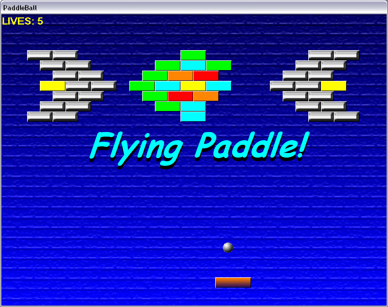



## PaddleMax 2

### Description

Finally the much-awaited (i wish :-P) sequel to PaddleMax, the extremely popular (i wish) game that stormed (i wish) the net!

No, seriously, its a VB spinoff of those classing "destroy the bricks with the bouncing ball" games, with some cool powerups that give it a unique edge. I just took all the feedback given on the 1st one and made a second one with all new levels!

It comes with a level editor, and is COMPLETELY commented. Please vote and leave comments!
 
### More Info
 

             |
---                |---
**Submitted On**   |2004-05-10 15:56:46
**By**             |[Alex\_"CumQuaT"\_Norton](https://github.com/Planet-Source-Code/PSCIndex/blob/master/ByAuthor/alex-cumquat-norton.md)
**Level**          |Intermediate
**User Rating**    |4.8 (29 globes from 6 users)
**Compatibility**  |VB 6\.0
**Category**       |[Games](https://github.com/Planet-Source-Code/PSCIndex/blob/master/ByCategory/games__1-38.md)
**World**          |[Visual Basic](https://github.com/Planet-Source-Code/PSCIndex/blob/master/ByWorld/visual-basic.md)
**Archive File**   |[PaddleMax\_1744305122004\.zip](https://github.com/Planet-Source-Code/alex-cumquat-norton-paddlemax-2__1-53727/archive/master.zip)

